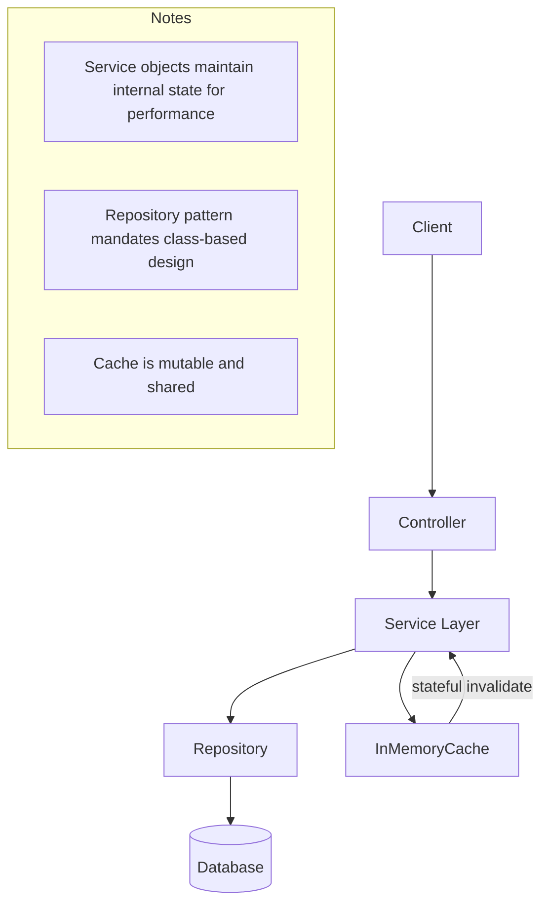

# Architecture

```mermaid
graph TD
  A[Client] --> B[Controller]
  B --> C[Service Layer]
  C --> D[Repository]
  C --> E[InMemoryCache]
  E -->|stateful invalidate| C
  D --> F[(Database)]

  subgraph Notes
    N1[Service objects maintain internal state for performance]
    N2[Repository pattern mandates class-based design]
    N3[Cache is mutable and shared]
  end
```
