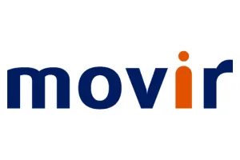
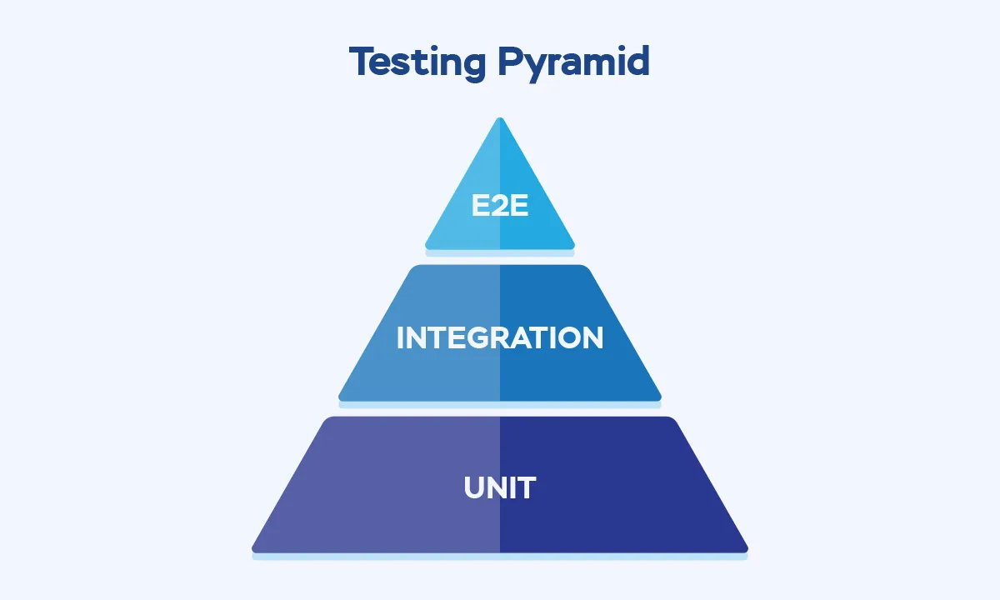
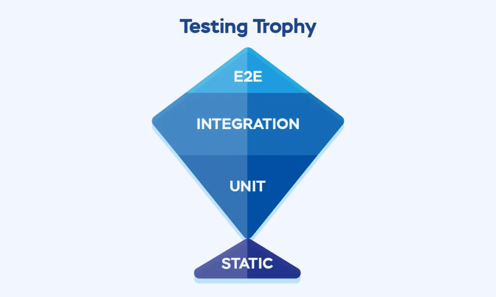
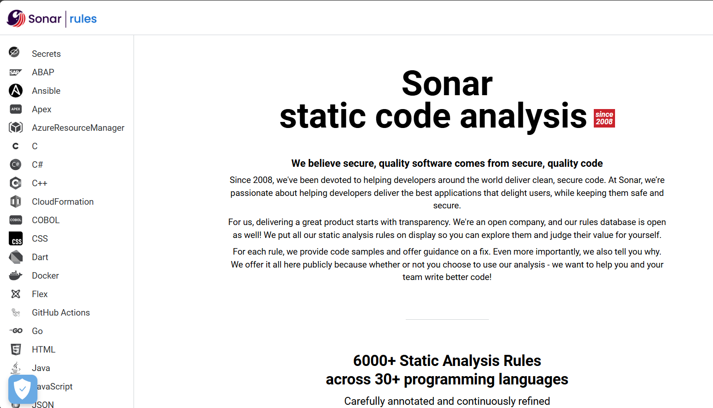

# Workshop Introduction: Using GitHub Copilot for Code Quality

Enjoy the workshop!
Welcome to the workshop on practical use of GitHub Copilot in agent mode!

---

## About me: Wouter Fennis

Software Engineer and Scrum Master.

- Microsoft-oriented developer with a passion for programming,
CI/CD, and architecture
- Blog: [woutercompiles.it](https://www.woutercompiles.it)

---

## My work: Info Support

I'm a consultant at Info Support in Veenendaal.

- Started as a student
- .NET minor
- 2017 &nbsp;&nbsp;&nbsp;&nbsp;  

|    |    |
|:---:|:---:|
|    |    |

---

## Goals

- Understand how 'context' guide AI agents to align code with project/company standards
- Learn to leverage Copilot for maintaining code quality
- Practice writing and refining prompts, instruction files, README files

---

## Agenda

1. Introduction to Copilot agent mode
2. What is 'context', why does it matter?
3. Hands-on labs: applying and customizing instructions
4. Assignments: improving code quality with Copilot
5. Securing standards for other teammembers/colleagues

---

---

---

---

---

---

---

---

---

## Context

- Instruction files: `.github/copilot-instructions.md`, `AGENT.md`, etc.
- Project-specific conventions
  - `.editorconfig`
  - `README.md`
  - `mermaid.md`
- Code quality standards
  - `https://rules.sonarsource.com/csharp/`
  - `Roslyn Analyzers`

---

- MCP servers
- AI-driven code review and refactoring
  - "Assign to CoPilot"

---

## Prerequisites

- Visual Studio Code
- Github Copilot (chat) Extension
- Language specific extensions

---
# The labs

--- 

# Sources

baytechconsulting.com/blog/test-pyramid-vs-testing-trophy-whats-the-difference